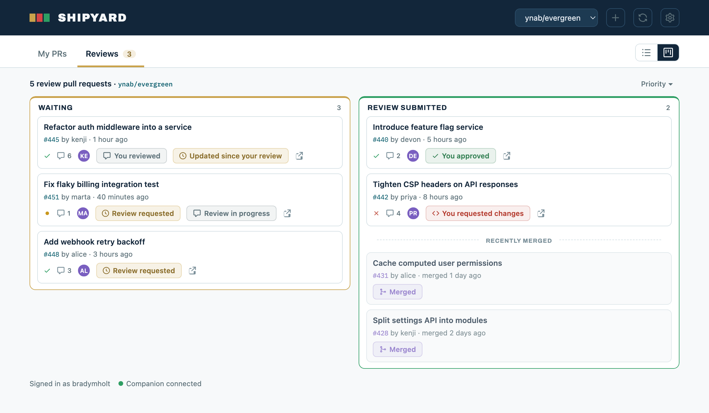

# Shipyard

Shipyard is a focused dashboard for staying on top of GitHub pull requests. It brings reviewer state, CI status, stacked PRs, and the work that needs your attention into one place. Use it directly from GitHub Pages, or run it locally to connect PRs to local branches and open them in your preferred app or IDE.

[Try Shipyard in your browser](https://bradymholt.github.io/shipyard/)

## Screenshots

### Board view

See drafts, waiting work, approvals, and recent merges by stage.


### List view

Prioritize PRs with reviewer, review, and CI status visible together.


### Review board

Track the PRs you owe a review, split into what's still waiting on you and what you've already reviewed, with counts and pending-review indicators.



## Quick start

### Hosted mode

Open the [hosted dashboard](https://bradymholt.github.io/shipyard/), click the gear icon, add a GitHub token, then add a repository, organization, or username to your views. Nothing needs to be installed.

### Local mode

Local mode runs an optional companion process that opens checkouts in your preferred app or IDE and adds branch/worktree actions. It requires Git and Python 3, plus whichever app you configure.

```bash
git clone https://github.com/bradymholt/shipyard.git
cd shipyard
python3 shipyard.py ~/dev
open http://localhost:4321
```

Replace `~/dev` with a folder that directly contains your Git clones, then open the URL printed by the command. You can pass more than one folder or use `--port` to choose another port.

## GitHub token

A fine-grained personal access token limited to the repositories you use is recommended. Pull requests read access is enough for viewing; write access is needed to toggle auto-merge or mark a draft ready for review. A classic token needs the `repo` scope for private repositories.

Your token and recent dashboard data stay in your browser's local storage. The token is sent only to `api.github.com`. The hosted and local versions use separate browser storage, so each needs to be configured once.

## Features

- **Action-focused views:** My PRs and Reviews, with priority, updated, and created sorting.
- **List and board layouts:** reviewer state, new commits since your review, drafts, approvals, and ready-to-merge work at a glance.
- **Useful context:** CI checks, labels, comments, stacked PR relationships, and your three most recently merged PRs.
- **Flexible scope:** combine repositories, organizations, and usernames, then filter across titles, authors, branches, and repositories.
- **PR actions:** toggle auto-merge and move drafts to ready without leaving the dashboard.
- **Optional local workflow:** open existing checkouts in your preferred app or IDE, or start a branch in the main clone or an isolated worktree.

## Local companion

Local mode starts `shipyard.py`, a small companion process that serves the dashboard and matches GitHub PR branches to clones found under your configured folders. It binds to localhost and accepts branch actions only from the dashboard it serves.

Worktree discovery is read-only. Actions you choose can fetch, create, or switch local branches and create worktrees. Shipyard refuses to switch a main clone with tracked changes, opens an existing checkout when one already owns the branch, and never removes existing worktrees. New worktrees are created under `<repo>/.claude/worktrees/`.

For a persistent setup, copy the example configuration and adjust `roots`:

```bash
cp shipyard.config.example.json shipyard.config.json
python3 shipyard.py
```

```json
{
  "roots": ["~/dev"],
  "launcher": {
    "name": "VS Code",
    "mode": "url",
    "target": "workspace",
    "url": "vscode://file/{path}",
    "command": ["code", "{path}"]
  },
  "branchPrefix": ""
}
```

VS Code is the default, but the launcher is app-agnostic. URL mode opens a custom URL scheme in the browser; command mode asks the companion to run a command. Use `{path}` where the checkout path belongs. `target` can be `folder`, or `workspace` to prefer a `.code-workspace` file when one exists.

For example, this opens the checkout folder in Xcode on macOS:

```json
{
  "launcher": {
    "name": "Xcode",
    "mode": "command",
    "target": "folder",
    "command": ["open", "-a", "Xcode", "{path}"]
  }
}
```

`branchPrefix` optionally prefills new branch names.

### Run at login (macOS)

<details>
<summary>Keep the companion always running with a <code>launchd</code> agent</summary>

To start the companion at login and keep it running in the background, install it as a LaunchAgent. Save the following as `~/Library/LaunchAgents/local.shipyard.plist`, replacing the two paths with your own — LaunchAgents don't expand `~`, so both must be absolute. The Python path is `/opt/homebrew/bin/python3` on Apple Silicon and `/usr/local/bin/python3` on Intel.

```xml
<?xml version="1.0" encoding="UTF-8"?>
<!DOCTYPE plist PUBLIC "-//Apple//DTD PLIST 1.0//EN" "http://www.apple.com/DTDs/PropertyList-1.0.dtd">
<plist version="1.0">
<dict>
  <key>Label</key>
  <string>local.shipyard</string>
  <key>ProgramArguments</key>
  <array>
    <string>/opt/homebrew/bin/python3</string>
    <string>/Users/you/dev/shipyard/shipyard.py</string>
  </array>
  <key>WorkingDirectory</key>
  <string>/Users/you/dev/shipyard</string>
  <key>RunAtLoad</key>
  <true/>
  <key>KeepAlive</key>
  <true/>
  <key>EnvironmentVariables</key>
  <dict>
    <key>PATH</key>
    <string>/opt/homebrew/bin:/usr/bin:/bin:/usr/sbin:/sbin</string>
  </dict>
  <key>StandardOutPath</key>
  <string>/tmp/local.shipyard.stdout</string>
  <key>StandardErrorPath</key>
  <string>/tmp/local.shipyard.stderr</string>
</dict>
</plist>
```

`WorkingDirectory` lets the companion find your `shipyard.config.json`. Load it (and start it immediately) with:

```bash
launchctl load ~/Library/LaunchAgents/local.shipyard.plist
```

Output and errors go to `/tmp/local.shipyard.stdout` and `/tmp/local.shipyard.stderr`. To stop and remove it:

```bash
launchctl unload ~/Library/LaunchAgents/local.shipyard.plist
```

</details>

## Development

There is no build step or dependency installation. Serve `index.html` with `python3 -m http.server`, or run `python3 shipyard.py ~/dev` to exercise local mode. Issues and pull requests are welcome.

## License

Shipyard is available under the [MIT License](LICENSE).
