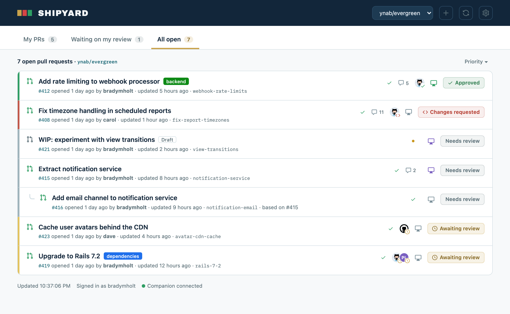
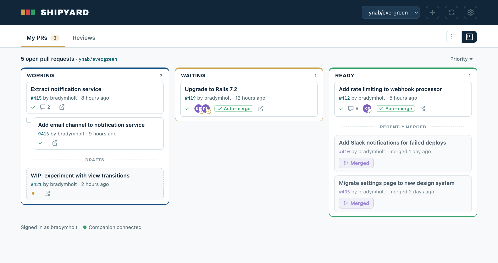

# Shipyard

A GitHub pull request dashboard, hosted on GitHub Pages. It shows open PRs with reviewer and review-status info that GitHub's default list view doesn't surface.

**Live:** https://bradymholt.github.io/shipyard/

## Screenshots

### List view

Priority-sorted list with review status, reviewers, CI checks, stacked PRs nested under their parent, and - when the local companion is running - open-in-VS-Code links:



### Board view

Swim lanes by PR state - Working (drafts shown dashed), Waiting (on a reviewer), and Ready (approved), with your last couple of merged PRs shown dimmed under Ready:



## Features

- **Views**: add any mix of repos (`owner/repo`), orgs, or usernames and switch between them
- **List view**: GitHub-style list with review status, CI check status, labels, and comment counts. Shows reviewer avatars (with per-reviewer state) on your PRs, and the author's avatar on "Waiting on my review" so you can see whose PR needs you
- **Sort**: list views sort by priority (default), recently updated, or recently created
- **Board view**: swim lanes for Working / Waiting / Ready on the My PRs tab, with drafts styled distinctly in Working (click a card's Draft pill to mark it ready for review)
- **Auto-merge**: Waiting and Ready cards show auto-merge status with a one-click toggle
- **Stacked PRs**: PRs based on another open PR's branch are nested under their parent in both views
- **Recently merged**: on the My PRs tab, your last 2 merged PRs appear dimmed with a purple "Merged" badge - at the bottom of the list and under the Ready lane - for quick reference
- **Priority sort**: one of the list sort options - ready-to-merge first, then actionable-by-author, then needs-reviewer, awaiting-review last
- **Filters**: My PRs / Waiting on my review / All open tabs, plus text filter across title, author, branch, and repo. The default load fetches only your PRs and ones awaiting your review; "All open" fetches the full set on demand the first time you open it
- **Local worktree links** (optional): when run via the local companion, PRs whose branch you have checked out locally get an "Open in VS Code" link
- **New branch** (optional): with the companion running, a **+** button starts a new branch off the default branch and opens it in VS Code - your choice of an isolated worktree or checked out in your main clone

## Setup

Open the page, click the gear icon, and paste a GitHub personal access token - classic with `repo` scope, or fine-grained with Pull requests: read access. The token is stored only in your browser's localStorage and is sent only to `api.github.com`.

## Local companion (optional)

`companion.py` is a small local server that adds "Open in VS Code" links for branches you have checked out as local git worktrees. It reads `git worktree list` and serves both the dashboard and a `/worktrees.json` endpoint.

```
python3 companion.py              # scan the folders set in companion.config.json
python3 companion.py ~/dev ~/work  # or override the roots on the command line
```

Set the folders to scan with a `"roots"` array in `companion.config.json` (see [Opening VS Code](#opening-vs-code) for the file). It's required: the companion exits with an error if no roots are configured and none are passed on the command line. Then open the printed `http://localhost:4321`. Pass `--port` as needed. It binds to localhost only, matches worktrees to PRs by the repo's `origin` remote + branch, and never writes anything to the repo. The hosted GitHub Pages copy doesn't reach the companion (browsers block HTTPS→localhost), so the worktree links only appear when you're viewing the dashboard through the companion.

Each PR row has a single **Open in VS Code** button whose behaviour depends on where the branch is checked out:

- **In a worktree** - opens that worktree (its `.code-workspace` as a workspace when one exists, otherwise the folder).
- **Your main clone's current branch** - opens the main clone; the icon is shown **green** to mark the branch your main clone is on right now.
- **Not checked out anywhere** - the companion checks the branch out in your main clone (`git switch`, fetching from `origin` first if it's remote-only) and opens it. When the main clone has uncommitted changes this isn't possible, so the icon shows in a muted "unavailable" tone with the reason in its tooltip.

By default it opens via a `vscode://file` link - see [Opening VS Code](#opening-vs-code) to run the `code` CLI instead. These links only appear when the companion is running. To start a *new* branch, use [New branch](#starting-a-new-branch) below.

### Starting a new branch

Everything above starts from an *existing* PR or branch. To start *new* work, a **+** button next to the repo selector (shown only when the companion is running) opens a "New branch" dialog: pick a repo you have cloned locally, type a branch name, and choose where it lands:

- **Worktree** - creates the branch in an isolated worktree (`git worktree add -b <branch> … origin/HEAD`, fetching the base first) under `<repo>/.claude/worktrees/`.
- **Main clone** - checks the new branch out in your main clone (`git switch -c`), for when you want the fully-cached environment. Guarded like "open in main": the button is disabled when the main clone has uncommitted changes.

Either way it branches off the repo's default branch and opens in VS Code. It's idempotent: if the branch already exists or is checked out, it just opens that. Once you push a PR from the branch it appears on the board like anything else, with the usual "Open in VS Code" link for going back to tweak it.

The footer shows a green "Companion connected" indicator when the page is talking to the companion, and "Companion not running" otherwise (e.g. on the hosted Pages copy).

Note: the companion serves the dashboard on a different origin (`localhost`) than Pages, so localStorage (token, views) is separate there - you enter the token once for the local origin.

### Opening VS Code

The companion reads a `companion.config.json` next to `companion.py` (it's gitignored) for the folders to scan and a few options. By default VS Code opens via `vscode://file` links; set `vscodeOpen` to `"cli"` to run the `code` CLI instead - handy for passing extra flags:

```json
{
  "roots": ["~/dev"],
  "vscodeOpen": "cli",
  "codeCliArgs": ["--disable-extension", "github.copilot-chat"],
  "branchPrefix": "brady/"
}
```

- `roots`: folders to scan for git clones. Required - the companion exits with an error if this is empty and no roots are passed on the command line (which overrides this).
- `vscodeOpen`: `"scheme"` (default, `vscode://` links) or `"cli"` (companion runs `code`). `"cli"` falls back to `"scheme"` when the `code` CLI isn't on PATH.
- `codeCliArgs`: extra arguments passed to `code`. The example disables an extension that crash-loops VS Code's extension host when a multi-root `.code-workspace` is opened from a linked worktree - so with it you get the full multi-root workspace in worktrees without the crash.
- `branchPrefix`: prefills the New branch dialog's branch-name field. Leave empty (the default) to use your signed-in GitHub username (e.g. `brady/`); set it to override with a fixed prefix.

## Development

No build step. Edit `index.html`, serve it locally (`python3 -m http.server`), and refresh. See `companion.py` for the optional worktree integration.
